<!-- Spider-Man Animated Vector SVG Web Banner -->

  
   
  
<em>"With great power comes great code."</em>

<h1 align="center">Majeri</h1>

  <strong>Software Engineer | Full-Stack & AI Explorer</strong> 
  Makassar, Indonesia

  
  
  
  
  
  

<table width="100%" border="0" cellspacing="0" cellpadding="0">
<tr valign="top">
<td width="50%" style="padding-right: 15px;">

<h3>Profile</h3>

Software Engineer yang berfokus pada pemecahan masalah secara praktis. Berpengalaman dalam pengembangan aplikasi web, otomasi workflow (Google Apps Script & Cloud APIs), serta eksplorasi Machine Learning.

 

<h3>Experience & Internship</h3>

<strong>Web Development Intern</strong> — Bosowa 
<em>Agustus 2025 – November 2025</em>

<ul>
  <li>Mengembangkan dan mengelola fitur-fitur pada aplikasi web internal perusahaan.</li>
  <li>Berkolaborasi dalam tim teknis untuk memastikan performa dan keandalan sistem web.</li>
</ul>

 

<h3>Featured Projects</h3>

<strong>Sistem Antrian Viola (BPJS Kesehatan Makassar)</strong> 
Repository: <a href="https://github.com/clientidprojectj-cloud/antrian-viola-bpjskesehatan-makassar">antrian-viola-bpjskesehatan-makassar</a>

<ul>
  <li>Membangun sistem antrian digital terintegrasi untuk BPJS Kesehatan Makassar.</li>
  <li>Memanfaatkan infrastruktur serverless gratis dengan mengombinasikan <strong>Google Sheets API</strong> dan <strong>Google Apps Script</strong> untuk manajemen data antrian secara real-time tanpa biaya server.</li>
</ul>

<strong>Client Projects Account</strong> 
GitHub: <a href="https://github.com/clientidprojectj-cloud">clientidprojectj-cloud</a>

<ul>
  <li>Akun sekunder yang digunakan untuk pengelolaan repositori proyek klien dan sistem otomasi.</li>
</ul>

 

<h3>Social & Links</h3>

<ul>
  <li><strong>LinkedIn</strong>: <a href="https://www.linkedin.com/in/majeri-majeri-881840246">linkedin.com/in/majeri-majeri-881840246</a></li>
  <li><strong>Google Developer</strong>: <a href="https://g.dev/jerytzed">g.dev/jerytzed</a></li>
  <li><strong>Google Skills Profile</strong>: <a href="https://www.skills.google/public_profiles/5def516f-808b-49e2-afc2-7d593d688448">skills.google Profile</a></li>
  <li><strong>GitHub Main</strong>: <a href="https://github.com/majeri03">github.com/majeri03</a></li>
  <li><strong>GitHub Projects</strong>: <a href="https://github.com/clientidprojectj-cloud">github.com/clientidprojectj-cloud</a></li>
</ul>

</td>
<td width="50%" style="padding-left: 15px;">

<h3>Skills</h3>

<strong>Languages</strong> 
<code>JavaScript</code> • <code>TypeScript</code> • <code>Python</code> • <code>HTML5</code> • <code>CSS3</code>

<strong>Frontend</strong> 
<code>React</code> • <code>Next.js</code> • <code>Vue.js</code> • <code>Vite</code> • <code>Tailwind CSS</code>

<strong>Backend & Automation</strong> 
<code>Node.js</code> • <code>Express</code> • <code>Google Apps Script</code> • <code>Google Sheets API</code> • <code>Firebase</code> • <code>MySQL</code> • <code>PostgreSQL</code>

<strong>AI & Machine Learning</strong> 
<code>Python</code> • <code>TensorFlow</code> • <code>Scikit-Learn</code>

<strong>Tools & Environment</strong> 
<code>Git</code> • <code>GitHub</code> • <code>Docker</code> • <code>Linux</code> • <code>VS Code</code> • <code>Figma</code>

 

<h3>Certificates & Badges</h3>

<ul>
  <li><strong>Google Developer Profile</strong>: <a href="https://g.dev/jerytzed">g.dev/jerytzed</a></li>
  <li><strong>Google Public Skills Badges</strong>: <a href="https://www.skills.google/public_profiles/5def516f-808b-49e2-afc2-7d593d688448">Public Skills Profile</a></li>
</ul>

 

<h3>Strengths</h3>

  
  
  
  
  
  

 

<h3>Current Vibe</h3>

🎵 <strong>Spotify Playlist</strong>: <a href="https://open.spotify.com/playlist/3GiISkQclMQzDBNyXZokc4?si=vJKtzdq7Q6Cozz2v5XL2pA&utm_source=copy-link&pt=8d59be8ceb75199bfba025c0a7ee80c7&pi=25d_HXekT4OFG">Dengarkan di Spotify</a>

</td>
</tr>
</table>

<h3 align="center">GitHub Statistics</h3>

  

  

    
  
  
  

 

<h3 align="center">Contribution Grid</h3>

  <picture>
    <source media="(prefers-color-scheme: dark)" srcset="https://raw.githubusercontent.com/majeri03/majeri03/output/github-contribution-grid-snake-dark.svg">
    <source media="(prefers-color-scheme: light)" srcset="https://raw.githubusercontent.com/majeri03/majeri03/output/github-contribution-grid-snake.svg">
    
  </picture>

  

  Majeri • <a href="https://github.com/majeri03">github.com/majeri03</a> • <a href="https://github.com/clientidprojectj-cloud">github.com/clientidprojectj-cloud</a>

